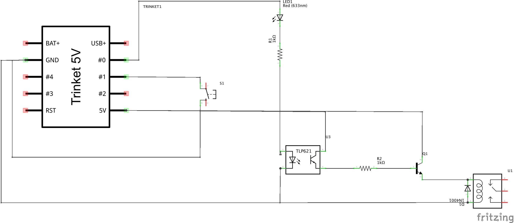

# Pseudo randomly timed relay
	

Developed for Adafruit Trinket (ATTiny85) so it should work also with bigger boards (Arduino Uno and so on).

## Author
Eduard Roccatello (eduard \<at\> xfce \<dot\> org).

## Components

* LEDs
* 5V controlled relay
* Two 1K resistors
* NPN transistor
* An optocoupler
* A rectifier diode

## Schematics
